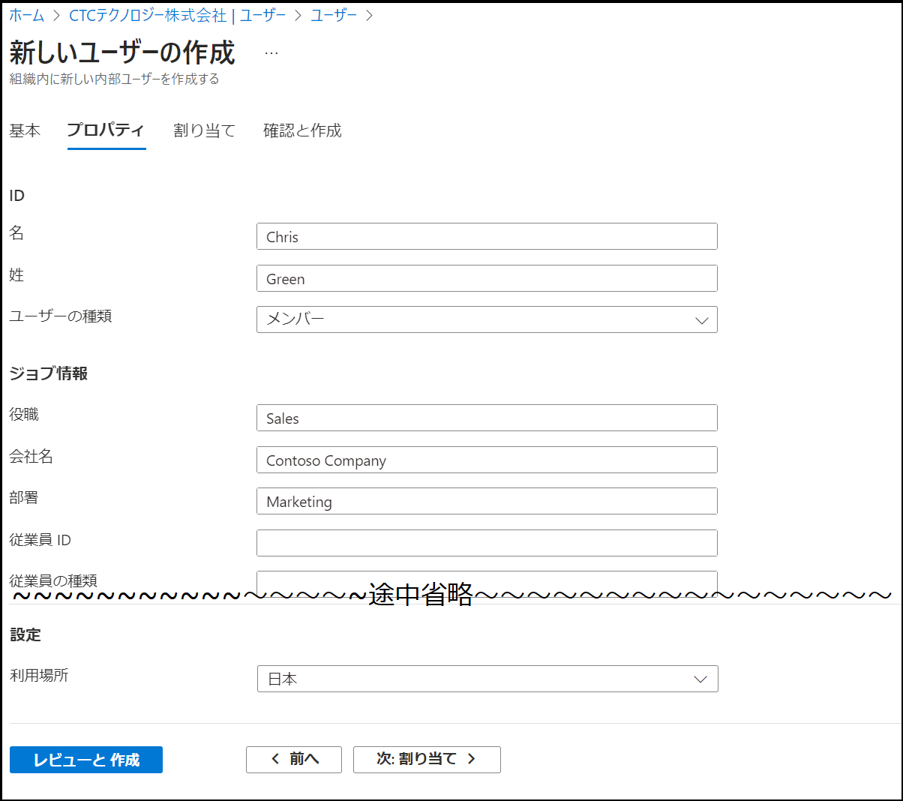
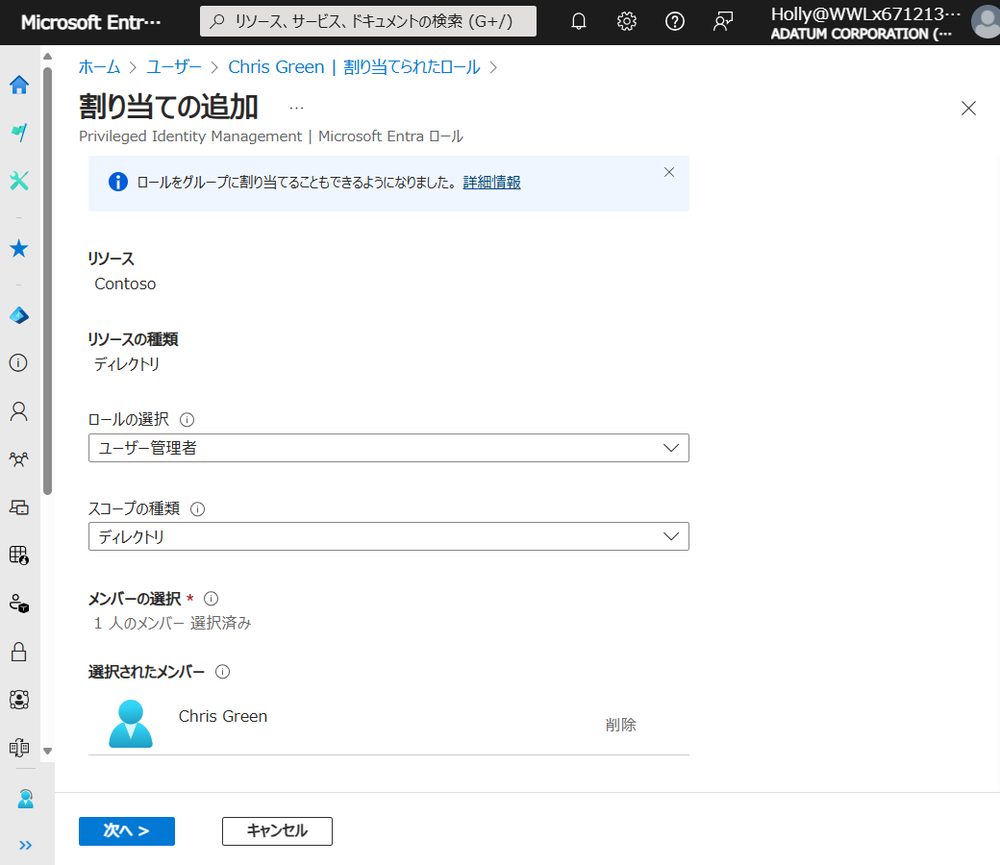
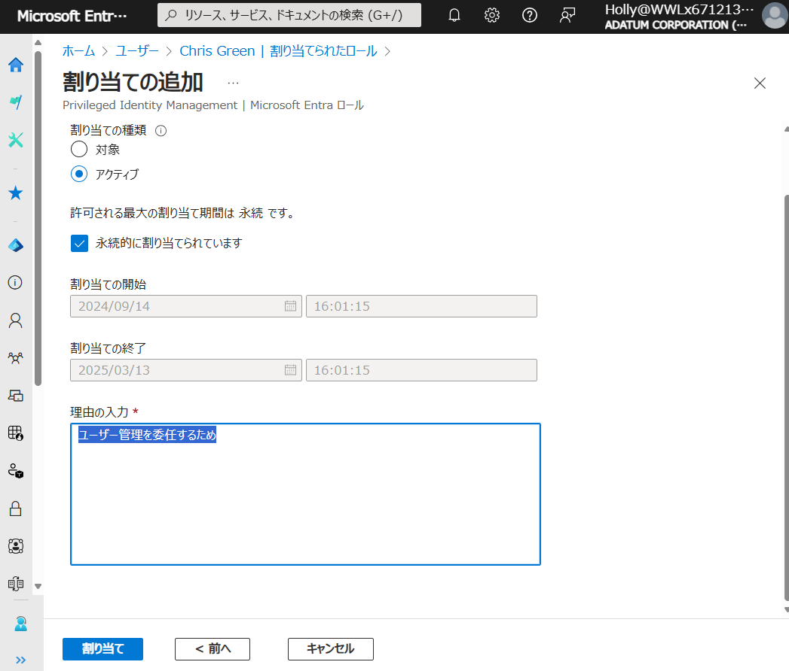
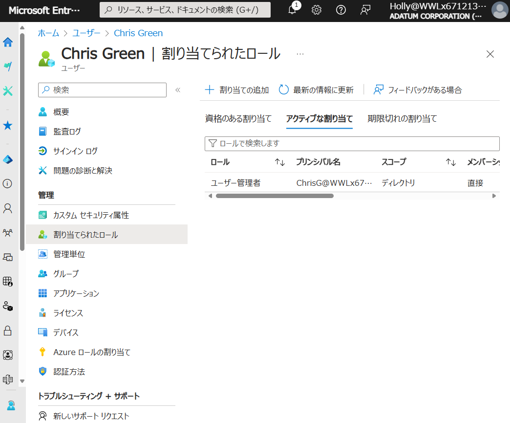

# ラボ01：ユーザーやグループの管理

## ラボ シナリオ

このラボでは以下のタスクを実施します。

　**タスク１：ユーザーを作成する**

　**タスク２：グループを作成し、メンバーを追加する**

　**タスク３：ユーザー管理者ロールを付与し、新たにユーザーを作成する**

　**タスク４：ユーザーやグループにライセンスを付与する**

## 予想時間: 30分

## タスク1 - ユーザーを作成する

1. https://entra.microsoft.com/ へアクセスし、以下のアカウントでサインインします。

   > 注：XXXXはご自身のアカウント番号を入力してください。
   >
   > 注：「アカウントの保護にご協力ください」と表示された場合は「今はしない」を選択してください

   | 項目                | 値                                   |
   | ------------------- | ------------------------------------ |
   | メール、電話、Skype | `admin@xxxxxxxxxxxx.onmicrosoft.com` |
   | パスワード          | Skillableで取得したパスワード        |

   

   

2. 画面左から「ID」→「ユーザー」→「すべてのユーザー」をクリックし、さらに＋「新しいユーザー」をクリックします。

   

   

3. 「**新しいユーザー**」 ブレードの「**基本**」タブで以下の項目を入力し、画面下部にある「**次：プロパティ**」をクリックします。

   > 注：表に無い項目は[デフォルトの値]または[未入力]となります。

   | 設定                                | 値                                                    |
   | ----------------------------------- | ----------------------------------------------------- |
   | ユーザー プリンシパル名             | **ChrisG**                                            |
   | メール ニックネーム                 | 自動入力のまま                                        |
   | ユーザー プリンシパル名から引き継ぐ | ✔を入れる（入れたまま）                               |
   | 表示名                              | **Chris Green**                                       |
   | パスワード                          | **Pa55w.rd12345**                                     |
   | パスワードの自動生成                | ✔を**外す** ※外すとパスワードの入力が可能となります。 |
   | 有効なアカウント                    | ✔を入れる（入れたまま）                               |

   

   

4. 「**新しいユーザー**」 ブレードの「**プロパティ**」タブで以下の項目を入力し、画面下部にある「**レビューと作成**」をクリックします。

   > 注：表に無い項目は[デフォルトの値]または[未入力]となります。

   | 設定     | 値                  |
   | -------- | ------------------- |
   | 名       | **Chris**           |
   | 姓       | **Green**           |
   | 役職     | **Sales**           |
   | 会社名   | **Contoso Company** |
   | 部署     | **Marketing**       |
   | 利用場所 | **日本**            |

   

   

5. 「**新しいユーザー**」 ブレードの「**確認と作成**」タブで設定した項目を確認し、画面下部にある「**作成**」をクリックします。

6. 画面上部の通知アイコン より「**ユーザーが正常に作成されました**」と表示されるのを待ちます。

7. 「ユーザー」画面に戻ります。画面中央の「更新」をクリックし、作成したユーザーが一覧上に表示されたことを確認します。

   

   

## タスク2 - グループを作成し、メンバーを追加する

1. https://entra.microsoft.com/ へアクセスします。

   > 注：XXXXはご自身のアカウント番号を入力してください。
   >
   > 注：「アカウントの保護にご協力ください」と表示された場合は「今はしない」を選択してください

   | 項目                | 値                                   |
   | ------------------- | ------------------------------------ |
   | メール、電話、Skype | `admin@xxxxxxxxxxxx.onmicrosoft.com` |
   | パスワード          | Skillableで取得したパスワード        |

   

2. 画面左ツリーの「ID」→「グループ」→「すべてのグループ」の順にクリックします。

   

   

3. 「グループ」画面が表示されます。「新しいグループ」をクリックします。

   

   

4. 「新しいグループ」画面が表示されます。次の情報を使用して「作成」をクリックします。

   > 注：指定の無い項目は、「空欄」または「デフォルト値」で結構です。

   | 項目           | 値           |
   | -------------- | ------------ |
   | グループの種類 | セキュリティ |
   | グループ名     | Marketing    |
   | メンバー       | Chris Green  |

   

   

5. 「グループ」画面に戻ります。画面中央の「更新」をクリックし、作成したグループが一覧上に表示されたことを確認します。

   

   

## タスク3 - ユーザー管理者ロールを付与し、新たにユーザーを作成する

1. https://entra.microsoft.com/ へアクセスします。

   > 注：XXXXはご自身のアカウント番号を入力してください。
   >
   > 注：「アカウントの保護にご協力ください」と表示された場合は「今はしない」を選択してください。

   | 項目                | 値                                   |
   | ------------------- | ------------------------------------ |
   | メール、電話、Skype | `admin@xxxxxxxxxxxx.onmicrosoft.com` |
   | パスワード          | Skillableで取得したパスワード        |

   

2. 画面左から「ID」→「ユーザー」→「すべてのユーザー」をクリックし、「Chris Green」をクリックします。

   

   

3. 「Chris Green」のプロファイル画面が表示されます。画面左の「割りあてられたロール」をクリックします。

   

   

   

4. 「Chris Green | 割り当てられたロール」が表示されます。画面中央の「+割り当ての追加」をクリックします。

   

   

5. 「割り当ての追加」が表示されます。「ユーザー管理者」を選択し、「次へ」をクリックします。

   > 注:見つからない時は「名前または説明で検索します」に「ユーザー管理者」と入力してください。

   

   

6. 「アクティブ」を選択し、理由の入力に「ユーザー管理を委任するため」と入力し、「次へ」をクリックします。

   

7. 「Chris Green | 割り当てられたロール」が表示されます。「最新の情報に更新」をクリックし、一覧上に表示されたこと確認してください。

   

   

8.  InPrivate ブラウザー ウィンドウを閉じます。

   

9. 新しい InPrivate ブラウザー ウィンドウを開きます。

   > 注:演習の中ではWebブラウザの機能を使って別セッションでサインインします。
   >
   >  どのWebブラウザもウィンドウ右上の設定ボタンから表示することが可能です。
   >
   >  Microsoft Edgeでは「InPrivate」ウィンドウ　 Google Chromeでは「シークレット」ウィンドウ
   >
   >  Mozilla Fire Foxでは「プライベート」ウィンドウ

   

10. Chris Green として、 https://entra.microsoft.com/ へアクセスします。

   > 注:XXXXはご自身のアカウント番号を入力してください。

   | 項目                | 値                                    |
   | ------------------- | ------------------------------------- |
   | メール、電話、Skype | `ChrisG@xxxxxxxxxxxx.onmicrosoft.com` |
   | パスワード          | Pa55w.rd12345                         |

   

11. パスワードを更新します。

    | 設定             | 値            |
    | ---------------- | ------------- |
    | 現在のパスワード | Pa55w.rd12345 |
    | 新しいパスワード | Pa55w.rd1234  |
    | パスワードの確認 | Pa55w.rd1234  |

    

12. 画面左から「ID」→「ユーザー」→「すべてのユーザー」をクリックし、さらに＋「新しいユーザー」をクリックします。

    > 注:「ユーザー管理者」ロールが割り当てられていない場合、「新しいユーザーの作成」がグレーアウトされクリックできません。

    

    

13. 「新しいユーザー」画面が表示されます。次の情報を使用して作成します。

    > 注：作成手順はタスク1 3～5 と同じ手順になります。

    | ユーザープリンシパル名 | 表示名       | 初期パスワード                 | 名   | 姓      | 役職  | 会社名          | 部署      | 利用場所 |
    | ---------------------- | ------------ | ------------------------------ | ---- | ------- | ----- | --------------- | --------- | -------- |
    | AdamJ                  | Adam Johnson | 自由に設定してください。 | Adam | Johnson | Sales | Contoso Company | Marketing | 日本     |

    > 注:指定の無い項目は、「空欄」または「デフォルト値」で結構です。
    >
    > 参考:サンプルユーザーの読み方
    >
    > 　　  Adam Johnson　アダム・ジョンソン

    

    

14. 「ユーザー」画面に戻ります。画面中央の「更新」をクリックし、作成したユーザーが一覧上に表示されたことを確認します。

    

    

15. 画面右上のユーザーアイコンをクリックし、「サインアウト」をクリックしてください。

    

    

**Lab01 は以上です。お疲れ様でした。**
