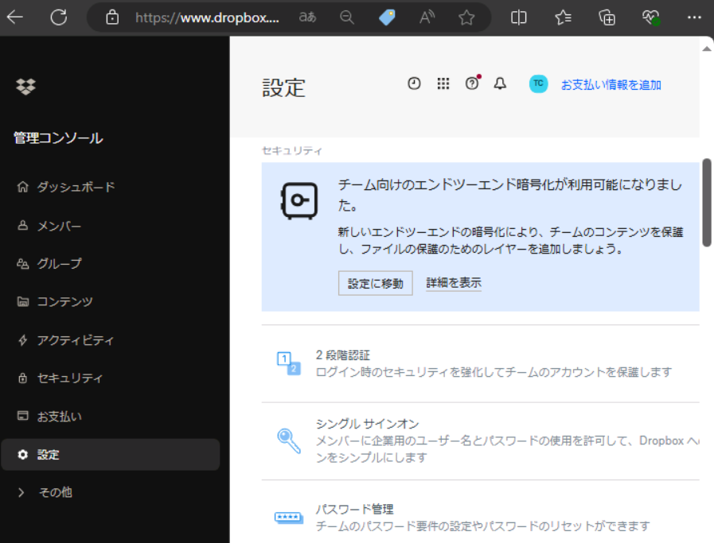
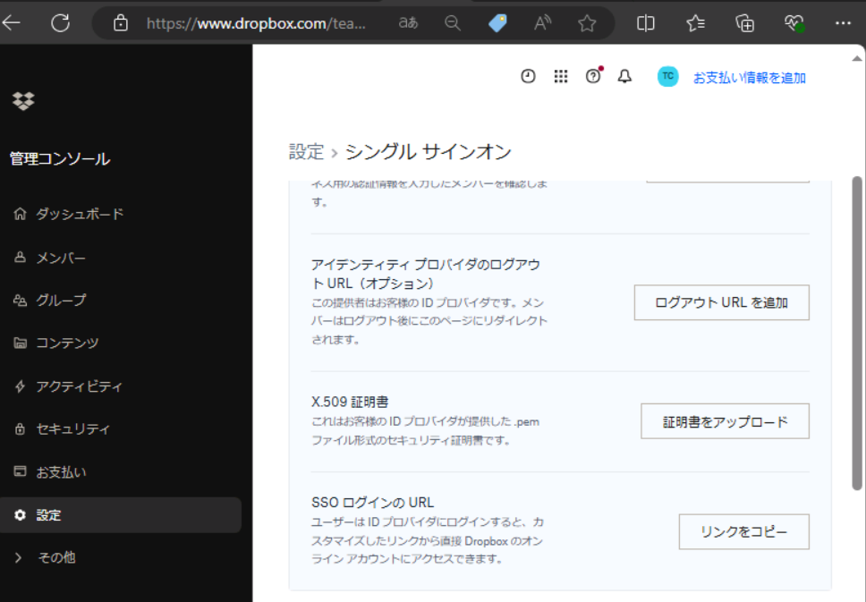
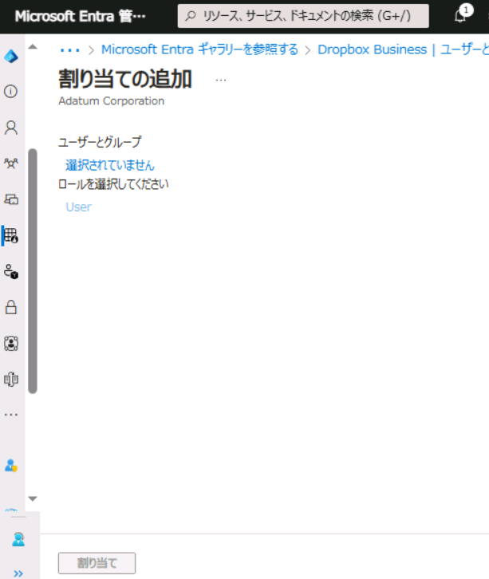
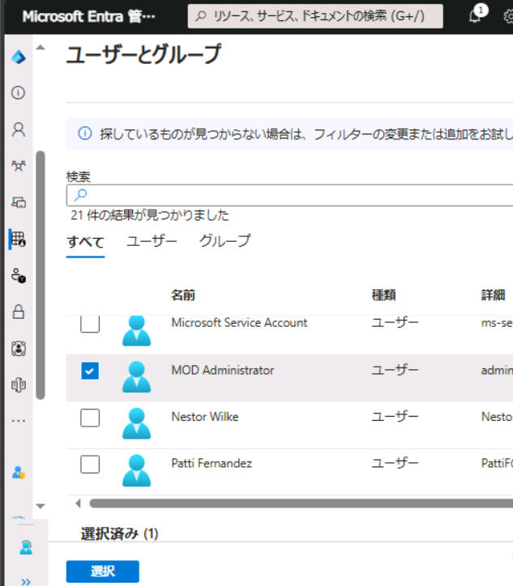
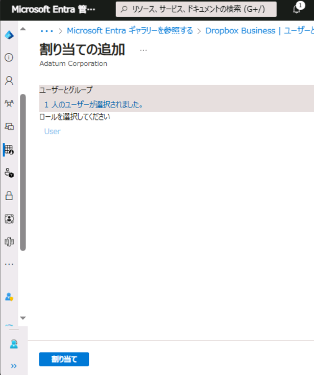
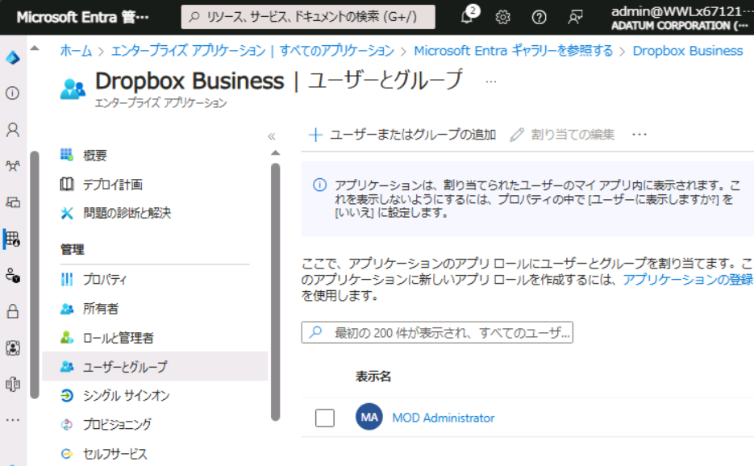
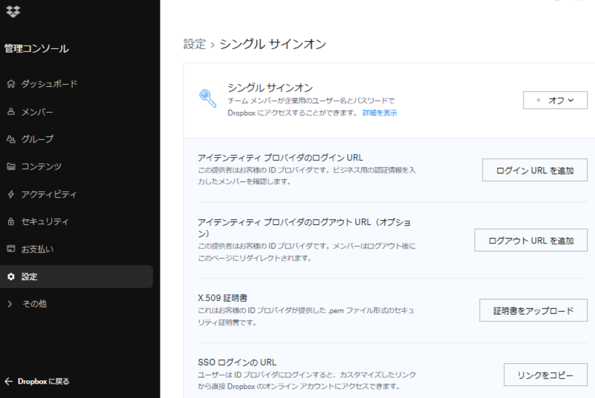
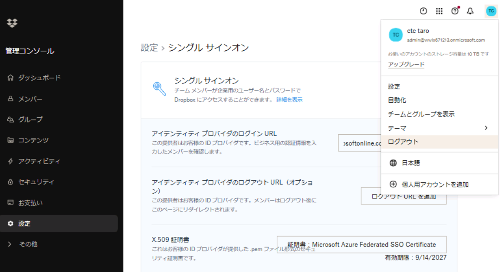

# ラボ：02 - クラウドアプリで SSO を実装する

## ラボ シナリオ

このラボでは以下のタスクを実施していただきます。

　**タスク1 - Dropbox Businessを利用登録する**

　**タスク2 - Azure AD でエンタープライズアプリケーションを登録する**

　**タスク3 - Dropbox Businessでシングルサインオンを構成する**

　**タスク4 - My Apps からDropbox Business にSSOを検証する**

> 参考：本ラボで「Dropbox Business」を採用した理由
>
> 　　　様々なクラウドアプリは無料版や試用版でも「クレジットカード」の登録が必要になります。
>
> 　　　「Dropbox Business」の試用版はクレジットカード登録不要で利用できるため、採用しています。

#### 推定時間: 30分

## タスク1 - Dropbox Businessを利用登録する

1. Webブラウザを開き、https://www.dropbox.com/plans にアクセスします。

   > 参考：今回はSSOをするためBusiness Plusの無料試用版を用意しています。
   >

   

   

2. 「Business Plus」の「無料トライアル」をクリックします。

   

   

3. 「メール」に  `admin@xxxxxxxxxxxx.onmicrosoft.com`を入力し「続行」をクリックします。

   > 注：XXXXはご自身のアカウント番号を入力してください。

   

   

4. 次の情報を使用して「同意して登録」をクリックします。

   | 項目       | 値                            |
   | ---------- | ----------------------------- |
   | 名前       | taro                          |
   | 姓         | ctc                           |
   | パスワード | Skillableで取得したパスワード |

   

   

5. 画面が遷移します。チーム名にアルファベット数字4文字以上の任意の値を入力し、利用規約にチェックを入れ「無料トライアル版の利用を開始」をクリックします。

   

   

6. 画面が遷移し、「受信トレイでメール アドレスを確認してください」と表示されます。

   「Outlookを開く」をクリックします。

   

   

7. Outlookのサインイン画面が表示されます。  `admin@xxxxxxxxxxxx.onmicrosoft.com`のアカウントでサインインを行います。

   

   

8. 「受信トレイ」にDropboxから「メール アドレスを確認してください」というメールが届きます。メール内の「メールアドレスを確認」をクリックします。

   

   

9. 画面が遷移します。いくつか初期設定をする画面が表示されますが、「後にする」や「スキップ」などをクリックしたり、任意に回答します。

   > 注：この設定は、演習に影響しません。

   

   

10. 画面が遷移します。左メニューにある「管理コンソール」をクリックします。

       

11. 左メニューにある「設定」をクリックした後、画面を下にスクロールして「シングルサインオン」をクリックします。

   

   

11. 「設定＞シングル サインオン」画面が表示されます。「SSO ログインの URL」の「リンクをコピー」をクリックし、メモ帳などに貼り付けます。

    > 注：コピーしたリンクは、後の手順で使用します。
    >
    > 注：コピーしたリンクのサンプルです。#の数字が異なります。
    >
    > `https://www.dropbox.com/sso/###########`

    

    

12. 一度、Dropboxの画面を最小化します。

    

## タスク2 - Entra ID でエンタープライズアプリケーションを登録する

1. https://entra.microsoft.com/ へアクセスします。

   > 注:XXXXはご自身のアカウント番号を入力してください。
   >
   > 注:「アカウントの保護にご協力ください」と表示された場合は「今はしない」を選択してください。

   | 項目                | 値                                   |
   | ------------------- | ------------------------------------ |
   | メール、電話、Skype | `admin@xxxxxxxxxxxx.onmicrosoft.com` |
   | パスワード          | Skillableで取得したパスワード        |

   

2. 画面左ツリーの「ID」→「アプリケーション」→「エンタープライズ アプリケーション」の順にクリックします。

   

   

3. 「エンタープライズ アプリケーション | すべてのアプリケーション」が表示されます。「+新しいアプリケーション」をクリックします。

   

   

4. 「Azure AD ギャラリーの参照」が表示されます。「アプリケーションを検索」に「Dropbox」と入力し、「Dropbox Business」をクリックします。

   

   

5. 「Dropbox Business」画面が表示されます。「作成」をクリックします。

   

   

6. 画面が遷移し「Dropbox Business | 概要」が表示されます。「ユーザーとグループ」をクリックします。

   

   

7. 「Dropbox Business | ユーザーとグループ」画面が表示されます。「+ユーザーまたはグループの追加」をクリックします。

   

   

8. 「割り当ての追加」画面が表示されます。「選択されていません」のリンクをクリックします。

   

   

9. 以下のユーザーを選択し、「選択」をクリックします。

   > 注：XXXXはご自身のアカウント番号を入力してください。

   　・`admin@xxxxxxxxxxxx.onmicrosoft.com`

   

   

   

10. 「割り当て 」をクリックします。

   

   

11. 「Dropbox Business | ユーザーとグループ」で割りあてたユーザーが一覧に表示されたことを確認します。その後、「シングルサインオン」をクリックします。

    

    

12. 「Dropbox Business | シングル サインオン」画面が表示されます。「SAML」をクリックします。

    

    

    

13. 「Dropbox Business | SAML ベースのサインオン」画面が表示されます。「基本的なSAML構成」の「編集」をクリックします。

    

    

14. 「基本的な SAML 構成」が表示されます。前の演習手順でコピーしたSSO ログインの URL」を用意し、次の情報を使用して「保存」をクリックします。

    > 注：指定の無い項目は、「空欄」または「デフォルト値」で結構です。
    >
    > 注：コピーしたリンクのサンプルです。#の数字が異なります。
    >
    > 　　`https://www.dropbox.com/sso/###########`

    | 項目            | 値                                        |
    | --------------- | ----------------------------------------- |
    | 応答 URL の追加 | `https://www.dropbox.com/saml_login`      |
    | サインオン URL  | `https://www.dropbox.com/sso/###########` |

    

    

15. 保存成功後、画面右上の「閉じる」ボタンをクリックします。

    > 注：Webブラウザの「閉じる」ボタンではありません。

    

    

16. 「Dropbox BusinessでシングルサインオンをTest」と表示されます。「いいえ、後でtestします」をクリックします。

    

    

17. 「Dropbox Business | SAML ベースのサインオン」の「SAML 証明書」の項目にある「証明書 (Base64)」をダウンロードして保存します。

    > 注：ダウンロードしたデータは後の手順で使用します。保存場所はどちらでもOKです。
    >
    > 注：「Dropbox Business.cer」ファイルがダウンロードされます。

    

    

18. 「Dropbox Business | SAML ベースのサインオン」の「Dropbox Business のセットアップ」にある構成URLを展開し、「ログイン URL」の値をコピーしメモ帳などに貼り付けます。

    > 注：コピーしたリンクは、後の手順で使用します。

    

    

## タスク3 - Dropbox Businessでシングルサインオンを構成する

このタスクでは、AzureAD のエンタープライズアプリケーション側で出力した情報を、Dropbox Business側でも設定し連携します。

1. Dropbox Businessの「設定＞シングル サインオン」画面を表示します。

2. 次の情報を使用して「保存」をクリックします。

   | 項目                                      | 値                                                           |
   | ----------------------------------------- | ------------------------------------------------------------ |
   | シングルサインオン   (既定値は「オフ」)   | ドロップダウンリストから「任意」を選択します。               |
   | アイデンティティ プロバイダのログイン URL | エンタープライズアプリケーションの設定でコピーした「ログイン URL」 |
   | X.509 証明書                              | エンタープライズアプリケーションの設定でダウンロードした「Dropbox Business.cer」 |

   

   

   

3. 画面右上のアカウントアイコンをクリックし、ログアウトを行います。

   
   
   

## タスク4 - My Apps からDropbox Business にSSOを検証する

1. https://myapplications.microsoft.com/ へサインインします。

   > 注:XXXXはご自身のアカウント番号を入力してください。
   >
   > 注:「アカウントの保護にご協力ください」と表示された場合は「今はしない」を選択してください。

   | 項目                | 値                                   |
   | ------------------- | ------------------------------------ |
   | メール、電話、Skype | `admin@xxxxxxxxxxxx.onmicrosoft.com` |
   | パスワード          | Skillableで取得したパスワード        |

   

2. 「マイアプリ」画面が表示されます。「Dropbox Business」をクリックします。

   

   

3. サインイン画面に遷移します。そのままサインインします。

   > 注：正常に動作する場合、パスワード入力せずにサインインが行われます。

   

4. Dropboxのトップページが表示されます。

   

   

   

**Lab02 は以上です。お疲れ様でした。**

