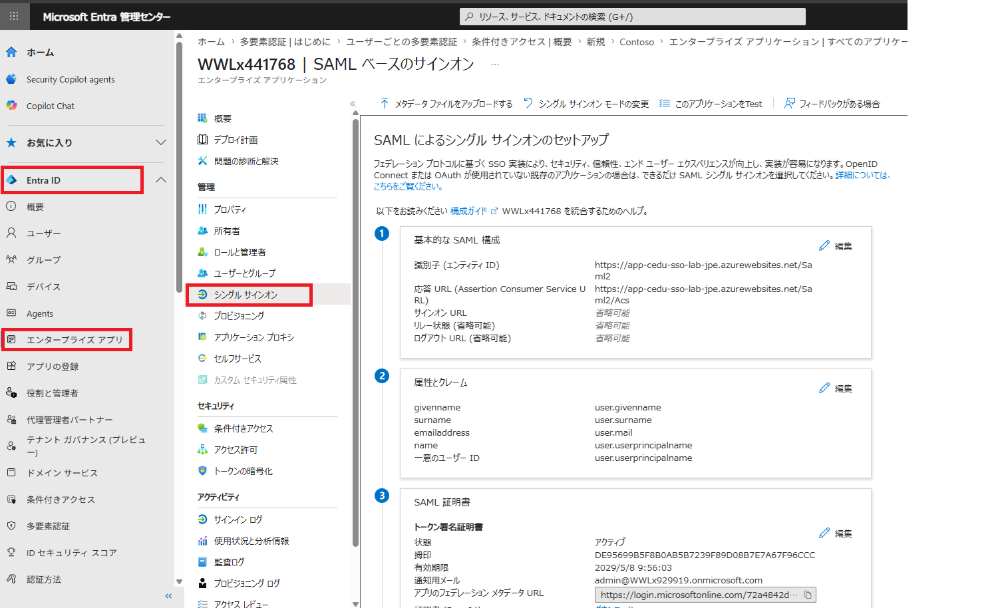
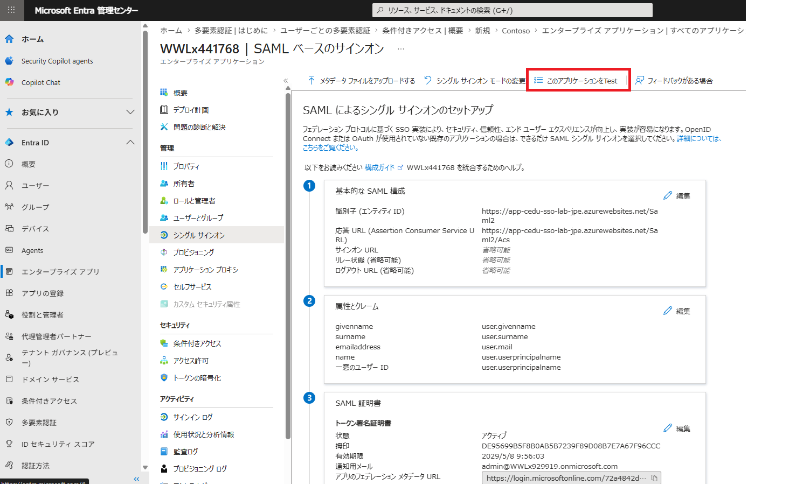
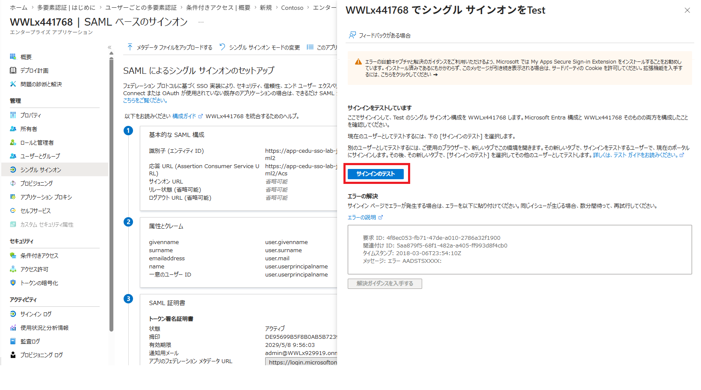
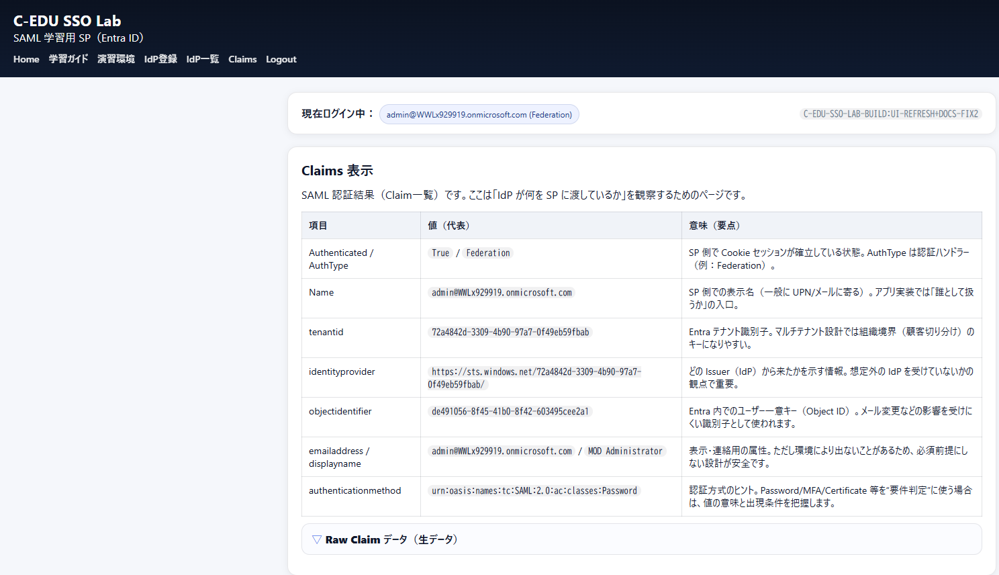

# ラボ：02 - クラウドアプリで SSO を実装する

## ラボ シナリオ

このラボでは以下のタスクを実施していただきます。

　**タスク1 - Microsoft Entra IDでテナントIDを取得する**

　**タスク2 - エンタープライズアプリケーションでアプリの登録を行う**

　**タスク3 -  SSO確認サイトへアクセスする**

　**タスク4 - SSOの確認**

#### 推定時間: 30分

## タスク1 - Microsoft Entra IDでテナントIDを取得する

1. https://entra.microsoft.com/ へアクセスし、以下のアカウントでサインインします。

   > 注：XXXXはご自身のアカウント番号を入力してください。
   >
   > 注：「アカウントの保護にご協力ください」と表示された場合は「今はしない」を選択してください

   | 項目                | 値                                   |
   | ------------------- | ------------------------------------ |
   | メール、電話、Skype | `admin@xxxxxxxxxxxx.onmicrosoft.com` |
   | パスワード          | Skillableで取得したパスワード        |

   

2. 画面左から「Entra ID」→「概要」をクリックし、「テナントID」を確認し、ご自身のメモ帳等に保存します。

   

## タスク2 - エンタープライズアプリケーションでアプリの登録を行う

1. https://entra.microsoft.com/ へアクセスします。

   > 注:XXXXはご自身のアカウント番号を入力してください。
   >
   > 注:「アカウントの保護にご協力ください」と表示された場合は「今はしない」を選択してください。

   | 項目                | 値                                   |
   | ------------------- | ------------------------------------ |
   | メール、電話、Skype | `admin@xxxxxxxxxxxx.onmicrosoft.com` |
   | パスワード          | Skillableで取得したパスワード        |

2. 画面左ツリーの「Entra ID」→「エンタープライズ アプリ」の順にクリックします。

   

3. 「エンタープライズ アプリケーション | すべてのアプリケーション」が表示されます。「+新しいアプリケーション」をクリックします。

   

4. 「Microsoft Entra アプリ ギャラリーの参照」が表示されます。「独自のアプリケーションの作成」をクリックします。

   

5. 「独自のアプリケーションの作成」画面が表示されます。以下の項目を入力し、「作成」をクリックします。
   注:XXXXはご自身のアカウント番号を入力してください。
   （例：admin＠WWLx441768.onmicrosoft.comの場合は「WWLx441768」）
   
   | 項目                   | 値                                                           |
   | ---------------------- | ------------------------------------------------------------ |
   | アプリ名               | WWLxXXXXXX                                                   |
   | アプリケーションの操作 | ギャラリーに見つからないその他のアプリケーションを統合します (ギャラリー以外)（default） |
   
     

6. 画面が遷移し「設定したアプリ名（例：WWLx441768） | 概要」が表示されます。

   「シングルサインオン」をクリックします。

   

7. 「シングルサインオン」画面が表示されます。「SAML」をクリックします。

   

8. 「シングルサインオン」画面が表示されます。「基本的なSAML構成」の「編集」をクリックします。

   

9. 「基本的なSAML構成」画面が表示されます。
   「識別子の追加」、「応答URLの追加」から以下の値を入力し、「保存」をクリックします。
   「基本的なSAML構成」画面を閉じます。

   | 項目    | 値                                                       |
   | ------- | -------------------------------------------------------- |
   | 識別子  | https://app-cedu-sso-lab-jpe.azurewebsites.net/Saml2     |
   | 応答URL | https://app-cedu-sso-lab-jpe.azurewebsites.net/Saml2/Acs |

   

10. 「シングルサインオン 」の画面に戻ります。もし、以下のようなポップアップが出てきた方は「いいえ、後でtestします」をクリックします。

           

11. シングルサインオン画面の「③SAML証明書」の中の「アプリのフェデレーションメタデータURL」をコピーし、ご自身のメモ帳等に保存します。

    

## タスク3 - SSO確認サイトへアクセスする
1. http://app-cedu-sso-lab-jpe.azurewebsites.net （SSO確認サイト）へアクセスします。

2. 画面上部の「IdP登録」をクリックします。

   

3. IdP登録画面が開きます。以下の項目を入力し、登録をクリックします。

   | 項目                    | 値                                                           |
   | ----------------------- | ------------------------------------------------------------ |
   | Alias                   | タスク2-11で設定したアプリ名（例：WWLx441768）               |
   | Tenant ID               | タスク1-2でコピーしたテナントID （例：72a4842d-3309-4b90-97a7-0f49eb59fbab） |
   | Federation Metadata URL | タスク2-11でコピーしたアプリのフェデレーションメタデータURL  |

   

14. Idp一覧に登録済みIdpとして登録されます。「Login」をクリックします。
    

15. 「Claims表示」という項目が出てくればLogin成功になります。
    ※画面下の「Raw Claim データ」から認証のやり取りが見れます。

    

16. 確認後、画面上部の「Logout」をクリックします。

    

17. 「現在ログイン中：未ログイン」になったことを確認する。
    

## タスク4 - SSOの確認

1. https://entra.microsoft.com/ へアクセスします。

    > 注:XXXXはご自身のアカウント番号を入力してください。
    >
    > 注:「アカウントの保護にご協力ください」と表示された場合は「今はしない」を選択してください。

    | 項目                | 値                                   |
    | ------------------- | ------------------------------------ |
    | メール、電話、Skype | `admin@xxxxxxxxxxxx.onmicrosoft.com` |
    | パスワード          | Skillableで取得したパスワード        |

2. 画面左ツリーの「Entra ID」→「エンタープライズ アプリ」→「シングルサインオン」の順にクリックします。

    

3. シングルサインオンの画面にある「このアプリケーションをTest」をクリックします。

    

4. 「WWLxXXXXでシングルサインオンをTest」の「サインインのテスト」をクリックします。
    注:XXXXはご自身のアカウント番号が表示されます。

    

5. 「Claims表示」の画面が出てきたらSSO成功になります！

    

**Lab02 は以上です。お疲れ様でした。**

