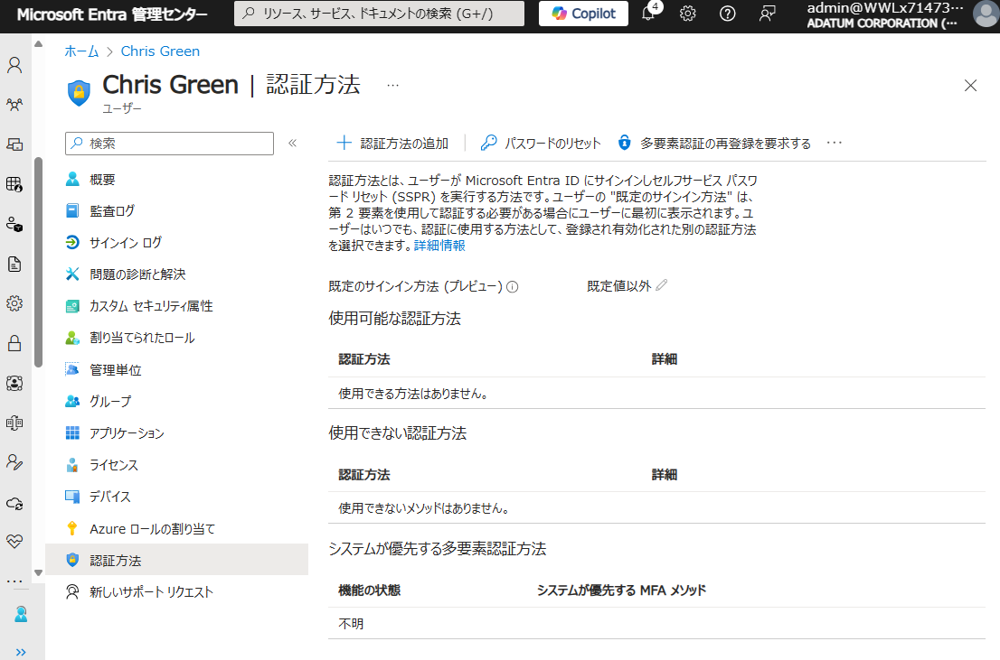
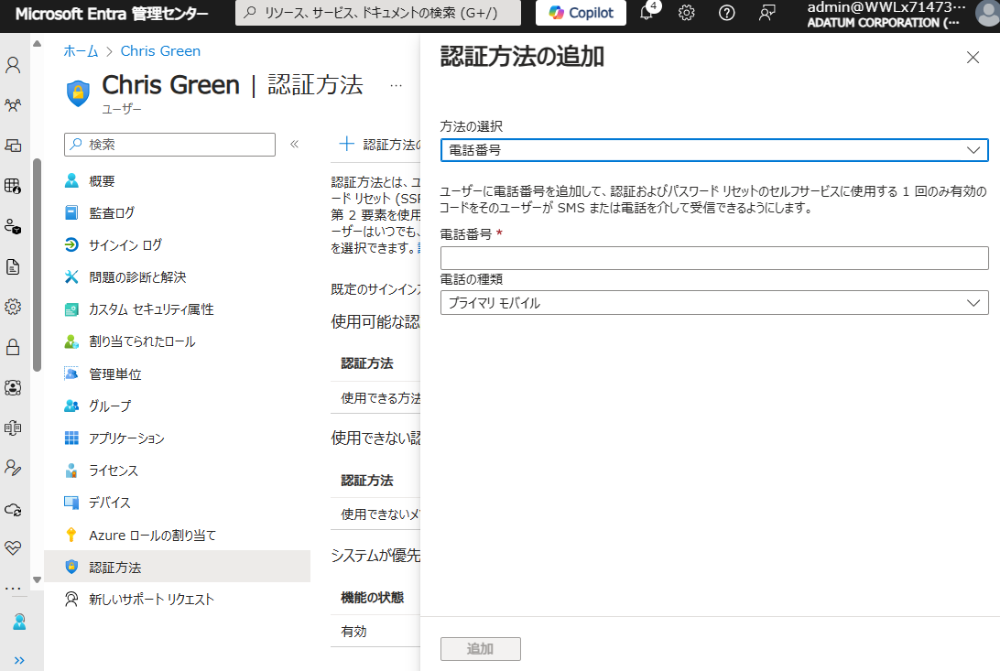
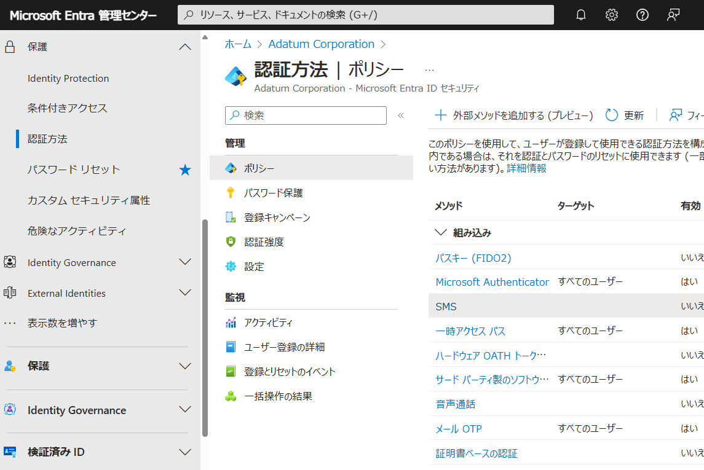
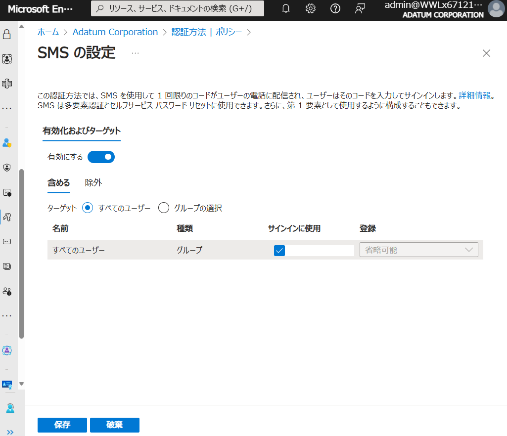

# ラボ：03 - Azure AD で SMS を使用した MFA を実装する

## ラボ シナリオ

このラボでは以下のタスクを実施していただきます。

　**タスク1 - 多要素認証の設定を確認する**

　**タスク2 - MFAの条件付きアクセスのルールを設定する**

　**タスク3 - MFAに必要な電話番号をユーザープロファイルに登録する**

　**タスク4 - Office 365 にアクセスし、MFAを検証する**

> 注：このタスクでは、ご自身の電話番号が必要となります。会社用/プライベート用どちらでも結構です。

#### 推定時間: 20分

## タスク1 - 多要素認証の設定を確認する

1.  https://entra.microsoft.com/ へアクセスします。

   > 注:XXXXはご自身のアカウント番号を入力してください。
   >
   > 注:「アカウントの保護にご協力ください」と表示された場合は「今はしない」を選択してください。

   | 項目                | 値                                   |
   | ------------------- | ------------------------------------ |
   | メール、電話、Skype | `admin@xxxxxxxxxxxx.onmicrosoft.com` |
   | パスワード          | Skillableで取得したパスワード        |

   

2. 画面左ツリーの「表示数を増やす」をクリックします。

   

   

3. 画面左ツリーの「保護」→「多要素認証」の順にクリックします。

   

   

4. 「多要素認証 | はじめに」画面が表示されます。「クラウドベースの多要素認証の追加設定」をクリックします。

   

   

5. 別タブが開き「多要素認証」画面が表示されます。設定できる項目を確認し、タブを閉じます。

   > 注：ここでは設定変更は行いません。設定できる内容を見ていただきます。

   

## タスク2 - MFAの条件付きアクセスのルールを設定する

1. 画面左ツリーの画面左ツリーの「保護」→「条件付きアクセス」の順にクリックします。

   

   

3. 「条件付きアクセス | 概要」画面が表示されます。「+新しいポリシーを作成する」をクリックします。

   

   

   

4. 「新規」画面が表示されます。

   

   

4. 名前に「Offce365_MFA」と入力します。

   

   

   

   

5. 「ユーザー」にて次の情報を選びます。

   | 項目 | 値                           |
   | ---- | ---------------------------- |
   | 対象 | ユーザーとグループの選択     |
   | -    | ユーザーとグループにチェック |
   | 選択 | Chris Green                  |
   
   
   
   
   
7. 「ターゲット リソース」にて、次の情報を使用して「選択」をクリックします。

   | 項目 | 値           |
   | ---- | ------------ |
   | 対象 | アプリを選択 |
   | 選択 | Office 365   |
   
   
   
   
   
8. 「許可」にて、次の情報を使用して「選択」をクリックします。

   | 項目                 | 値               |
   | -------------------- | ---------------- |
   | 多要素認証を要求する | チェックを入れる |

   

   

9. 「レポートの有効化」を「オン」に変更し、「作成」をクリックします。

   

   

10. 「条件付きアクセス | ポリシー」画面に遷移します。作成したポリシーが一覧に表示されたことを確認してください。

    

    

    

## タスク3 - MFAに必要な電話番号をユーザープロファイルに登録する

1. 画面左から「ID」→「ユーザー」→「すべてのユーザー」をクリックし、「Chris Green」をクリックします。

   

   

2. 画面左ツリーの「認証方法」をクリックします。

   

3. 「Chris Green | 認証方法」画面が表示されます。画面上の「＋認証方法の追加」をクリックします。

4. 「認証方法の追加」画面で、ドロップダウンリストから「電話番号」を選択した後、「電話番号」の欄にあなたの携帯電話番号を（下記注の記入例に従って）入力し「追加」をクリックします。

   > 注：記入例「+81 08012345678」です。「81」と「080」の間は半角空白です。
   >
   > 注：この後の演習でSMSを受信するために使用します。

   

   

5. Microsoft Entra 管理センターの左側のナビゲーション ウィンドウで、 「保護」  → 「認証方法」 を選択します。

   

6. 「認証方法 | ポリシー」 ウィンドウで、 「SMS」 のリンクを選択します。

   

   

7. 「SMS の設定」ウィンドウで [有効にする] のスライドバーを選択して有効にした後、 [保存] を選択します。

   

   

## タスク4 - Office 365 にアクセスし、MFAを検証する

1. 新しい InPrivate ブラウザー ウィンドウを開きます。

   > 注:演習の中ではWebブラウザの機能を使って別セッションでサインインします。
   >
   > 　 どのWebブラウザもウィンドウ右上の設定ボタンから表示することが可能です。
   >
   > 　 Microsoft Edgeでは「InPrivate」ウィンドウ
   >
   > 　 Google Chromeでは「シークレット」ウィンドウ
   >
   > 　 Mozilla Fire Foxでは「プライベート」ウィンドウ

2. Chris Green として、https://www.office.com へアクセスします。

3. パスワード認証後に「ID を確認する」画面が表示されます。「SMSを送信」をクリックします。

| 項目                | 値                                    |
| ------------------- | ------------------------------------- |
| メール、電話、Skype | `ChrisG@xxxxxxxxxxxx.onmicrosoft.com` |
| パスワード          | Pa55w.rd1234                          |

4. 登録した携帯電話に届いたSMSの番号を入力します。

   

   

5. 「サインインの状態を維持しますか?」と表示される場合があります。「いいえ」を選択してください。

   > 注:誤って「はい」を選択しても、演習に影響はありません。
   >
   > 注:「アカウントの保護にご協力ください」と表示された場合は、「今はしない」をクリックしてください。

   

6. Office 365にサインインできました。

   

   

   **Lab03 は以上です。お疲れ様でした。**
