# ラボ：03 - Microsoft Entra ID  で MFA を実装する

## ラボ シナリオ

このラボでは以下のタスクを実施していただきます。

　**タスク1 - 多要素認証の設定を確認する**

　**タスク2 - MFAの条件付きアクセスのルールを設定する**

　**タスク3 - Office 365 にアクセスし、MFAを検証する**

#### 推定時間: 15分

## タスク1 - 多要素認証の設定を確認する

1. https://entra.microsoft.com/ へアクセスします。

   > 注:XXXXはご自身のアカウント番号を入力してください。
   >
   > 注:「アカウントの保護にご協力ください」と表示された場合は「今はしない」を選択してください。

   | 項目                | 値                                   |
   | ------------------- | ------------------------------------ |
   | メール、電話、Skype | `admin@xxxxxxxxxxxx.onmicrosoft.com` |
   | パスワード          | Skillableで取得したパスワード        |

   

2. 画面左ツリーで「Entra ID」→「多要素認証」の順にクリックします。

   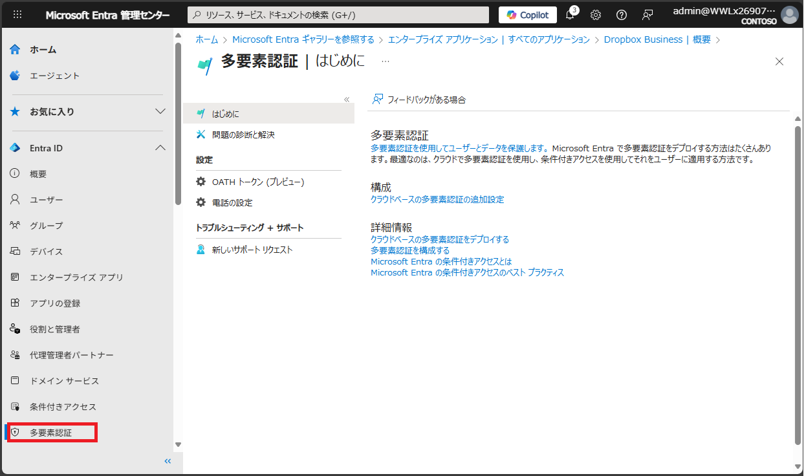

   

3. 「多要素認証 | はじめに」画面が表示されます。「クラウドベースの多要素認証の追加設定」をクリックします。

   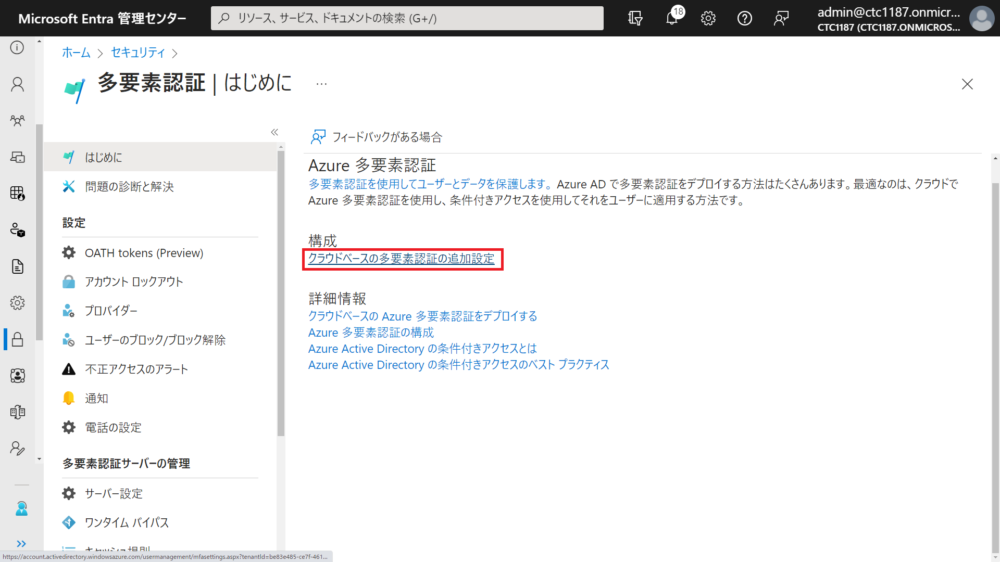

   

4. 別タブが開き「多要素認証」画面が表示されます。設定できる項目を確認し、タブを閉じます。

   > 注：ここでは設定変更は行いません。設定できる内容を見ていただきます。

   

## タスク2 - MFAの条件付きアクセスのルールを設定する

1. 画面左ツリーの画面左ツリーの「保護」→「条件付きアクセス」の順にクリックします。

   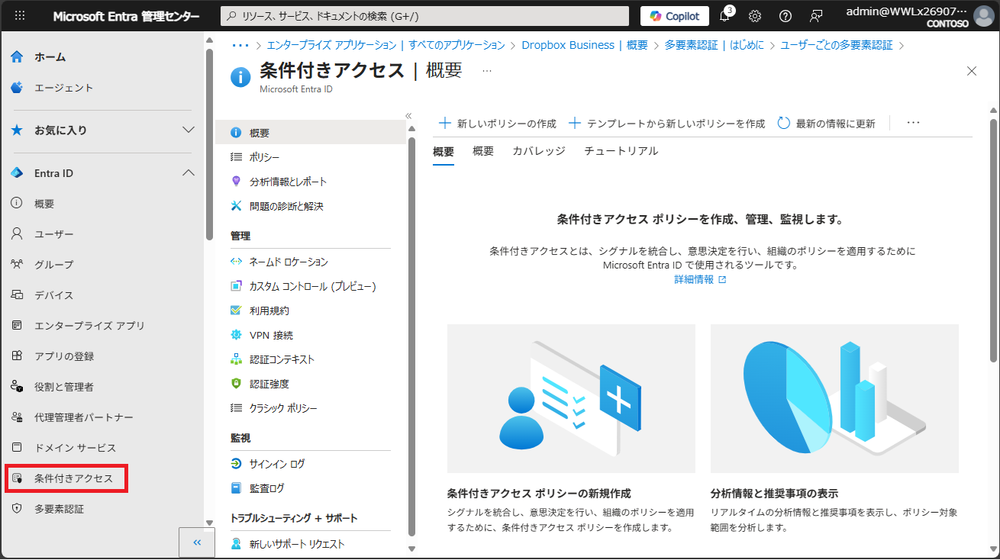

   

3. 「条件付きアクセス | 概要」画面が表示されます。「+新しいポリシーを作成する」をクリックします。

   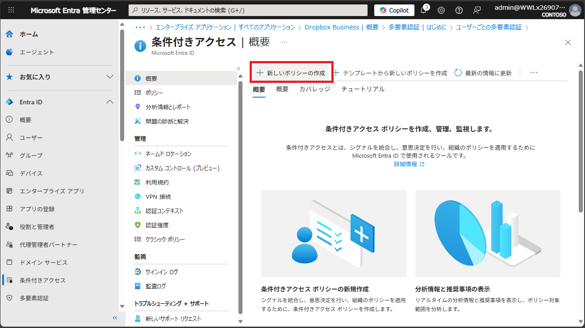

   

   

4. 「新規」画面が表示されます。

   

   

4. 名前に「Offce365_MFA」と入力します。

   

   

5. 「ユーザー」にて次の情報を選びます。

   | 項目 | 値                           |
   | ---- | ---------------------------- |
   | 対象 | ユーザーとグループの選択     |
   | -    | ユーザーとグループにチェック |
   | 選択 | Chris Green                  |
   
   
   
   
   
7. 「ターゲット リソース」にて、次の情報を使用して「選択」をクリックします。

   | 項目 | 値             |
   | ---- | -------------- |
   | 対象 | リソースの選択 |
   | 選択 | Office 365     |
   
   
   
   
   
8. 「許可」にて、次の情報を使用して「選択」をクリックします。

   | 項目                 | 値               |
   | -------------------- | ---------------- |
   | 多要素認証を要求する | チェックを入れる |

   

   

9. 「レポートの有効化」を「オン」に変更し、「作成」をクリックします。

   

   

10. 「条件付きアクセス | ポリシー」画面に遷移します。作成したポリシーが一覧に表示されたことを確認してください。

    

    

## タスク3 - Office 365 にアクセスし、MFAを検証する

1. 新しい InPrivate ブラウザー ウィンドウを開きます。

   > 注:演習の中ではWebブラウザの機能を使って別セッションでサインインします。
   >
   > 　 どのWebブラウザもウィンドウ右上の設定ボタンから表示することが可能です。
   >
   > 　 Microsoft Edgeでは「InPrivate」ウィンドウ
   >
   > 　 Google Chromeでは「シークレット」ウィンドウ
   >
   > 　 Mozilla Fire Foxでは「プライベート」ウィンドウ

   

2. Chris Green として、https://www.office.com へアクセスし、「サインイン」ボタンをクリックします。

   

3. 以下の資格情報で認証を実施します。

| 項目                | 値                                    |
| ------------------- | ------------------------------------- |
| メール、電話、Skype | `ChrisG@xxxxxxxxxxxx.onmicrosoft.com` |
| パスワード          | Pa55w.rd1234                          |

4. パスワード認証後に「アカウントをセキュリティで保護しましょう」画面が表示されます。「次へ」をクリックします。

   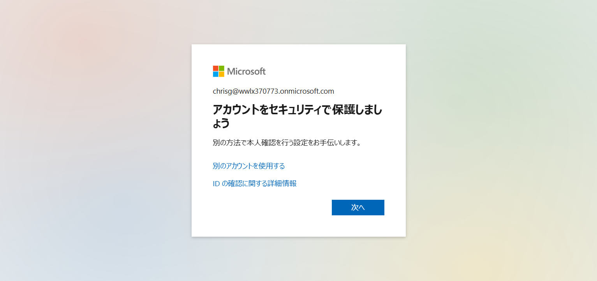

   

5. 「アカウントのセキュリティ保護」の「最初にアプリを取得します」画面で「次へ」をクリックします。

   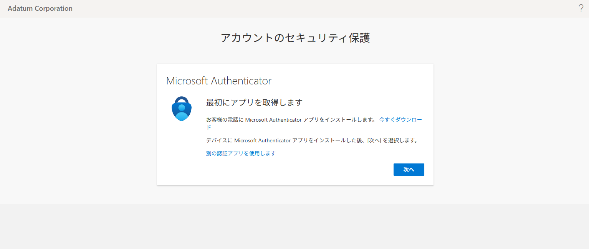

   

6. 「アカウントのセキュリティ保護」の「アカウントのセットアップ」画面で「次へ」をクリックします。

   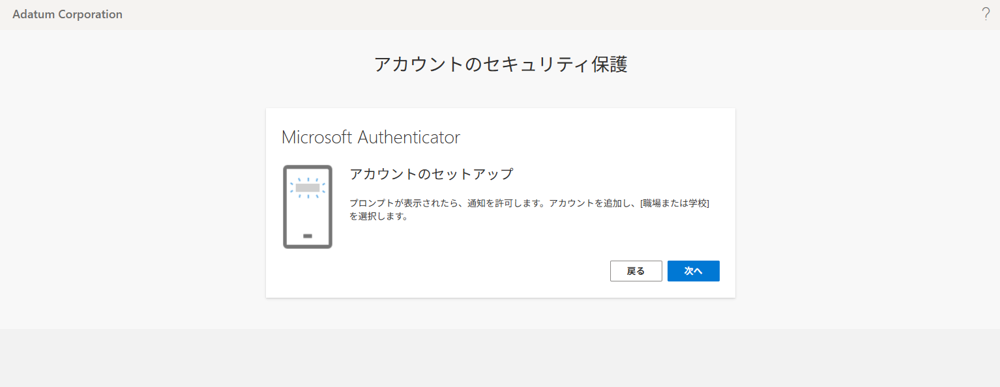

   

7. 「アカウントのセキュリティ保護」の「QR コードをスキャンします」画面が表示されます。お手持ちのスマートフォンのMicrosoft Authenticatorアプリにて、「+」(画面右上にあります) - 「職場または学校のアカウント」 - 「QRコードをスキャン」と選択して、QRコードをスキャンします。 InPrivate ブラウザー ウィンドウに戻り「次へ」をクリックします。

   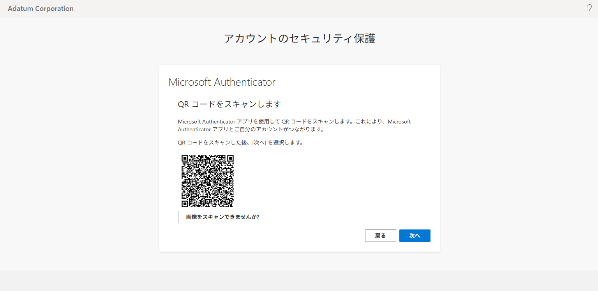

   

8. 「サインイン要求を承認」画面で表示された番号を使用して、Authenticatorアプリの認証を実施します。

   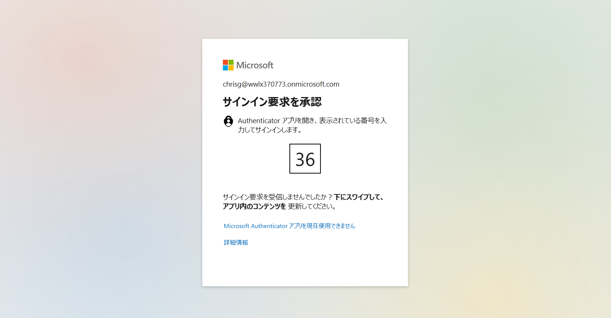

   

9. 「通知が承認されました」と表示されます。「次へ」をクリックします。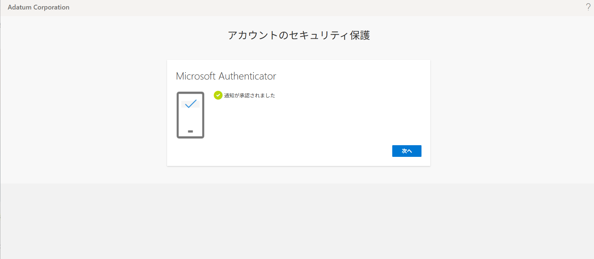

   

10. 「成功」と表示されます。「完了」をクリックします。

   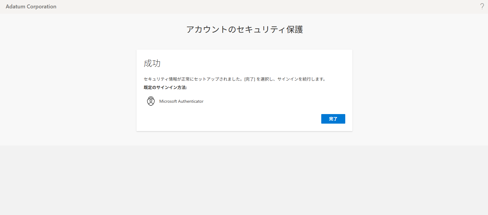

   

11. 「サインインの状態を維持しますか?」と表示される場合があります。「いいえ」を選択してください。

    > 注:誤って「はい」を選択しても、演習に影響はありません。
    >
    > 注:「アカウントの保護にご協力ください」と表示された場合は、「今はしない」をクリックしてください。

    

12. Office 365にサインインできました。

    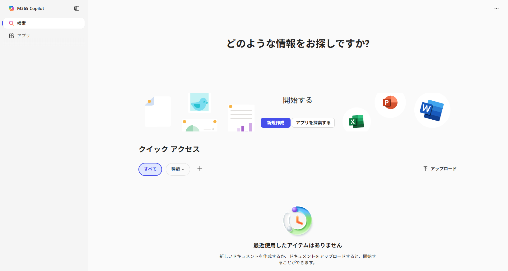

    

    **Lab03 は以上です。お疲れ様でした。**

